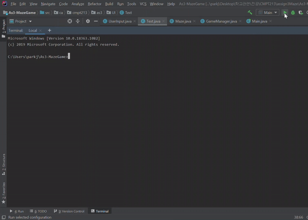

# Maze Game
Maze Game is a simple keyboard-driven **cat-mouse-cheese game**.  
Game is about a mouse (player) collecting cheese on a maze, while staying away from 3 different cats moving in random direction.  

## Technology
Langugae Used: **Java**
Development Tool: **IntelliJ**

## Setup
1) Download all files.  
2) Open files using Java development tool (Ex. IntelliJ).  
3) Run the application then the maze and list of commands should be displayed in terminal.  

## Example

